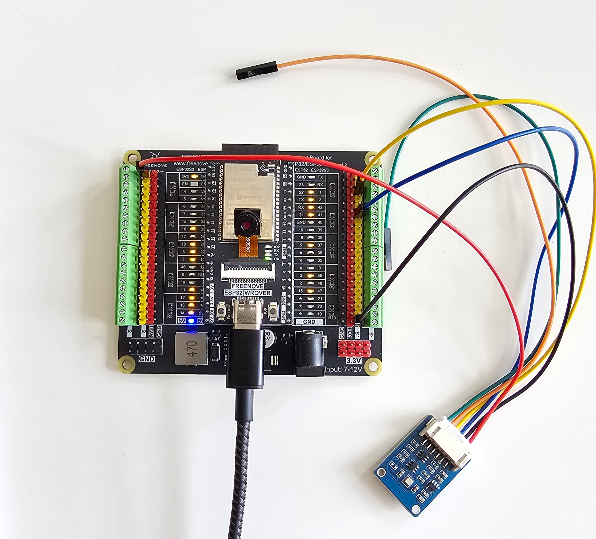

# EnvironmentSenseStation
Monitor environmental parameters using sensors driven by an ESP32.

## Features
- Measure ambient temperature, pressure, and humidity.
- Measure board temperature.
- Serve data over LAN using the onboard WiFi.
- Additional system to automate and drive the data collection and storage to a database.

## Hardware
- ESP32 board like [fnk0060](https://store.freenove.com/products/fnk0060) or [fnk0090](https://store.freenove.com/products/fnk0090).
- BME280 sensor from [The Pi Hut](https://thepihut.com/products/bme280-environmental-sensor). Product [specs](https://www.waveshare.com/wiki/BME280_Environmental_Sensor).
- Breakout board [fnk0091](https://store.freenove.com/products/fnk0091).
- Power supply (for independent operation)

### Dependencies
- Arduino IDE
- Install ArduinoJSON: see [image](./assets/arduinojson.jpeg) for help.
- To be able to talk to the sensor, we need the source code from the example code here:  library: [Waveshare BME280](https://www.waveshare.com/wiki/BME280_Environmental_Sensor#Code).

## Connect the sensors
The BME280 sensor from Waveshare has 6 pins and can be used with I2C or SPI. 
This project is using the I2C implementation.

| Function Pin | Controller Slot | Description |
| -------- | ------- | ------- |
| VCC | 3.3V / 5V | Power input |
| GND | GND | Ground |
| SDA | SDA | I2C data line |
| SCL | SCL | I2C clock line |
| ADDR | NC/GND | Address chip select (default is high): When the voltage is high, the address is 0 x 77. When the voltage is low, the address is: 0 x 76 |
| CS | NC | Used for SPI mode |

Using the information from [this source](https://docs.freenove.com/projects/fnk0091/en/latest/fnk0091/codes/tutorial/0_ESP32_ESP32S3%28Important%29.html#id2), the circuit looks like this: 



The pins used are the following:
- #21 for SDA
- #22 for SCL
- GND for GND
- 3V3 for VCC

## Operation
Build and upload the sketch in [sensor_server](./sensor_server/sensor_server.ino) to the controller.

Once the server is up and running on the controller, clients can request data by sending GET requests to the IP of the controller.
The response is in json format as follows:
```json
{
   "board_temperature": {
      "value": <temperature>,
      "unit": "C"
   },
   "temperature": {
      "value": <temperature>,
      "unit": "C"
   },
   "humidity": {
      "value": <humidity>,
      "unit": "%"
   },
   "pressure": {
      "value": <pressure>,
      "unit": "hPa"
   },
   "status": "ok"
}
```

## Data collection
The system that manages the data collection and storage can be found in the [server](./server/) folder.
The process is driven by the [main.py](./server/main.py) script and the [requirements.txt](./server/requirements.txt) file is used to create the virtual environment.
Before launching, you will need a `secrets.py` file with the following info:
```python
# secrets.py
URL=        # the url to request data from
HOST=       # the name or IP of the host of the database
DATABASE=   # the name of the database
DBUSER=     # the user name for the database
DBUSERPASS= # the user's password for the database
TABLENAME=  # the name of the database table
PORT=       # the port the database is listening to
```

### Automation
The automation can be achieved through the [sensing-wrapper.sh](./server/sensing-wrapper.sh) which assumes that the virtual environment is created in the same directory (same level) where the [server](./server/) folder is.
Make sure that the script is executable:
```bash
chmod +x server/sensing-wrapper.sh
```

The bash script can be added to crontab to run periodically.
To do so, open `crontab` with `crontab -e` and add something like: "*/10 * * * * $PROJECT_DIR/server/sensing-wrapper.sh >> ~/cron.log 2>&1" to run every 10 minutes and keep some logs along the way.

### Collection service as a container
The same effect can be achieved by building and running the collection service in a container.

To build it, run the following:
```bash
podman-compose build
```

To execute for testing, run the following:
```bash
podman-compose up -d
```

For longer term, run the following:
```bash
ln ./environment-sense-station.service ~/.config/systemd/user/environment-sense-station.service
systemctl --user daemon-reload 
systemctl --user enable --now environment-sense-station.service
```
----

## Tips
### Uploading sketches
Occasionally, the upload of a sketch might fail. Check the baud rate before attempting the upload. What usually works is 115200 and not the default 921600.

